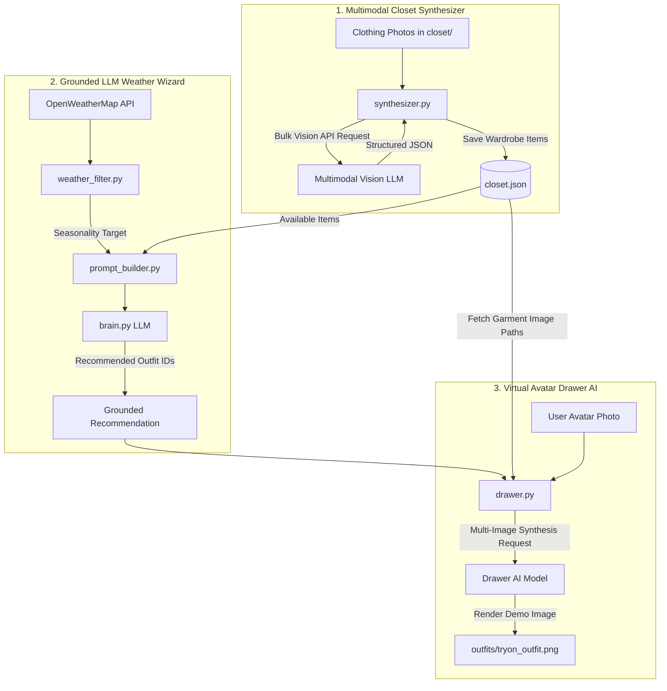

# Weather Wizard 3000 - Main Program Flow & Architecture Diagram

```mermaid
flowchart TD
    subgraph Ingestion ["1. Multimodal Closet Synthesizer"]
        A[Clothing Photos in closet/] --> B[synthesizer.py]
        B -->|Bulk Vision API Request| C[Multimodal Vision LLM]
        C -->|Structured JSON| B
        B -->|Save Wardrobe Items| D[(closet.json)]
    end

    subgraph Recommendation ["2. Grounded LLM Weather Wizard"]
        E[OpenWeatherMap API] --> F[weather_filter.py]
        F -->|Seasonality Target| G[prompt_builder.py]
        D -->|Available Items| G
        G --> H[brain.py LLM]
        H -->|Recommended Outfit IDs| I[Grounded Recommendation]
    end

    subgraph TryOn ["3. Virtual Avatar Drawer AI"]
        I --> J[drawer.py]
        D -->|Fetch Garment Image Paths| J
        K[User Avatar Photo] --> J
        J -->|Multi-Image Synthesis Request| L[Drawer AI Model]
        L -->|Render Demo Image| M[outfits/tryon_outfit.png]
    end
```
